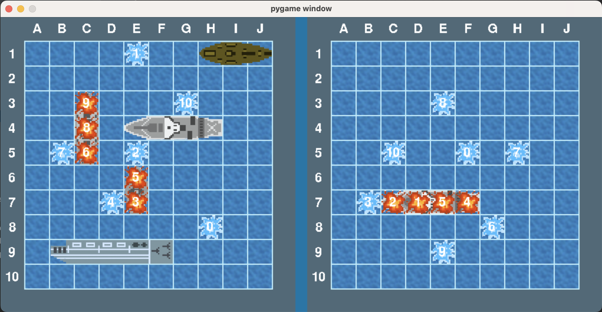

## Battleship Game

Author: Sora Chen  
Date: 04/30/2022  
Class: CS3C  
Instructor: Professor Erin Shaw

### Preview

### Description

This program implemented a battleship game. Run `main.py` to run the game.
The initial positions of the ships (both player and enemy) are pre-configured in a .JSON file (ships.json). 
The player can launch fire at an empty tile by clicking on the enemy's board (right-hand side). After launching a fire the tile will change to show if the fire hits or misses, and the enemy will also make a fire. Each ship can be sunk after every tile the ship is on is hit. The objective of this game is to sink all enemy ships before the enemy sinks all the player's ships.

### Requirement

The objective of this program is to implement a battleship game utilizing pygame in python.
The process is broke into 5 parts: display boards, initialize fleet, validate fleet, game play, and game play against a computer.
The program displays two boards side by side – one for the player and one for the enemy, both are a 10x10 grid of tiles.
There are also functions to initialize and display ships on the board which is done by reading the information from a JSON file. The position of the ship is then validated by the function `validateShip()`.
After finishing the configuration, the player can start the game by clicking on one of the empty tiles on the right side (enemy’s) board, and the tile will show an image of the choice hits or misses the enemy fleet which is hidden until a ship sinks.
Following the player’s move, the enemy, which is controlled by the computer, will also make a fire that displays hit or miss. The enemy AI first hits randomly for even grid tiles only (hunt mode), and if it hits a ship it will try to find the ship to hit (target mode).
The player can win by sinking all the enemy’s ships before the enemy sinks the player’s fleet, otherwise the player loses the game.

### Enhancement

I added a hovering effect which the player can know more clearly of which tile they are choosing for a better experience of the game.
For the AI part, apart from having the AI firing randomly at the even tiles and firing at nearby tiles if previously hit, I also have it to track the ship without firing at too many unnecessary tiles.
Also, when the game ends, a score of the player will be displayed regardless of whether they win or lose the game.

### Reference

Pygame tutorial:Tiles | https://pygame.readthedocs.io/en/latest/tiles/tiles.html
Battleship | https://www.datagenetics.com/blog/december32011/index.html
Calling parent class __init__ with multiple inheritance, what's the right way? | https://stackoverflow.com/questions/9575409/calling-parent-class-init-with-multiple-inheritance-whats-the-right-way
Proper way to declare custom exceptions in modern Python? | https://stackoverflow.com/questions/1319615/proper-way-to-declare-custom-exceptions-in-modern-python
RGB Color Codes Chart | https://www.rapidtables.com/web/color/RGB_Color.html

### Reflection

What did you learn/implement that worked that you are most proud of.

The main focus of mine in this project is to have great graphics and smooth game play, and also organized, clean code. So I am pretty satisfied with the graphics and game play since I drew the images by myself and tested the game several times to make sure the components acted properly. Most of my efforts are probably maintaining the code to be readable and organized, so I think I got much better at writing clean code now.
The part I have difficulty with the most is programming the AI algorithm. The battleship algorithm explained in the web page was pretty easy but when I wanted to enhance it it became very difficult to wrap my head around them. I was able to make the AI try to track the ship without hitting too many redundant tiles but it can certainly be better. Interpreting the row and column of the grid to the coordinate of the game window is also pretty tricky.
 
What would you do differently (something that didn't work as well as you wished)? 

I am not sure if I will want to do it any differently, if anything I think it would be better if I spend more time on the design beforehand so I will have a better idea of what classes I want to have and what responsibility they will carry that I won’t be changing things as much. Also I would want more time on thinking about how I will implement the AI because the deadline is closed and I failed to make myself sit still and think for the AI calmly.

### Conclusion

After doing this program I can see why people want to use a game engine instead of code entirely with pygame, but inevitably learned a lot from it and I also very much enjoy working on it.

### Test Plan
What will be tested in this program:
Basic display (board, tile, player ships, etc)
Hit and miss display
Game play
Game over
AI
Read and verify Ship info (json tile)
How will they be tested:
The basic displays are tested through launching the game and examining the display of the components along with the basic game play (firing by clicking on enemy board tiles). 
The hit miss display will be tested by firing at the enemy every tile (pause enemy fire) and to see if the hit display when click on the enemy ship tile and and miss otherwise.
The game play will be tested through play the game and take turns with enemy (AI) play. The number of fired tiles of the player should match to the enemy’s fired tile, and the hit and miss should match to the ship position. 
The game over will be tested by letting the player both win and lose the game and to see if the game over message displayed correctly.
The AI will be tested throughout several game play trials since it is conducted half randomly, and the focus will be how well the AI is going to be able to fire at the player’s ship without making unnecessary fires.
After placing the ship by reading a json file, the player ship should be displaying at the correct ship positions as configured, and the enemy ship should also display at the correct position when sunk. These positions will also be verified and the function will be tested through putting incorrect format of the information and invalid positions (such as out of bound and overlap of the ships).

